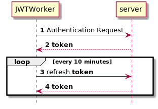

<p align="center">
  <h3 align="center">Python JWTWorker</h3>

  <p align="center">
    This python 3 class is responsible for authenticating and then refreshing a JWT token for you
  </p>
</p>

<br>


##### Simple example
The following sample code shows common usage.
First ask for a token using some credentials (User - password).
Then, every 10 minutes, refresh the token



```python
CREDENTIALS = {
    "email": "user@example.com",
    "password": "12345678"
}

BASE_URL = 'https://crazyurl.com/api'
MEASURE_ENDPOINT = '/data'
AUTH_ENDPOINT = '/login'
REFRESH_TOKEN_ENDPOINT = '/token/refresh'
TOKEN_REFRESH_TIME = 10 * 60  # in Segs

jwt = JWTWorker(
    CREDENTIALS,
    BASE_URL + AUTH_ENDPOINT,
    BASE_URL + REFRESH_TOKEN_ENDPOINT,
    TOKEN_REFRESH_TIME
)
jwt.run()
time.sleep(TOKEN_REFRESH_TIME * 5)
```


